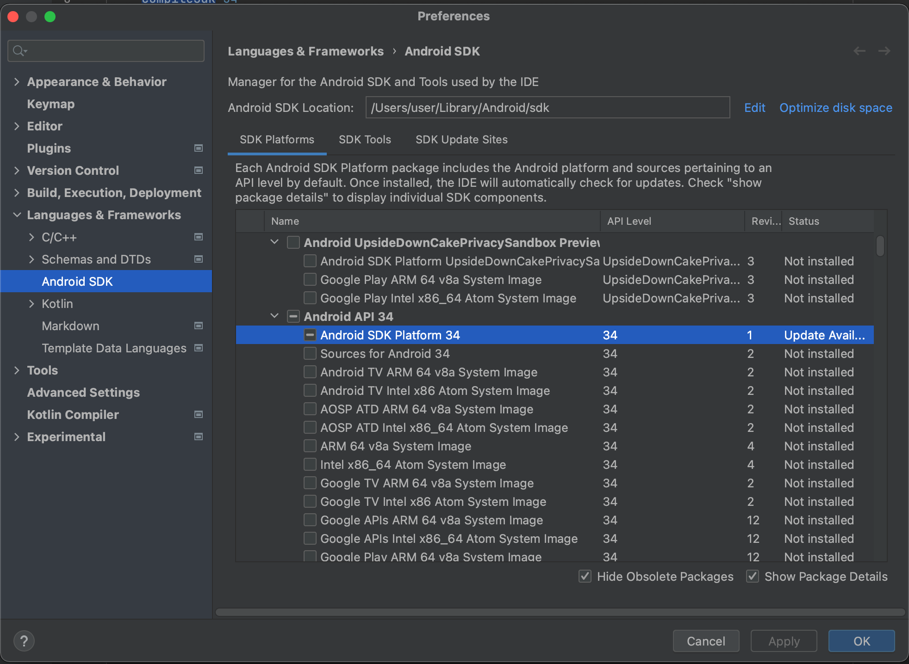

# LINE Planet Call for Android

LINE Planet Call is a demo app for LINE Planet, a cloud-based real-time communications platform as a service (CPaaS).

LINE Planet Call showcases the key features of LINE Planet, including 1-to-1 and group call functionalities. It can help you understand how to integrate LINE Planet into your services and enhance productivity when you implement your own app.

## Planet Documentation

[LINE Planet Documentation](https://docs.lineplanet.me/) provides additional resources to help you integrate LINE Planet into your service. 

These resources include LINE Planet specifications, developer guides for each client platform, and server API references.

## Features

LINE Planet Call provides the following features:

- **1-to-1 call**
    - Make a 1-to-1 audio/video call
    - Cancel a 1-to-1 audio/video call
    - End a 1-to-1 audio/video call
- **Group call**
    - Pre-check the camera and mic before a group call
    - Create a group video call room
    - Join a group video call room
    - Leave a group video call room
- **Basic features**
    - Mute/unmute the mic
    - Enable/disable the camera
    - Switch between the front and back cameras
    - Provide talker information
    - Display the participant's name

## Prerequisites

Before getting started with LINE Planet Call, do the following:

- Make sure that your system meets the [system requirements](https://docs.lineplanet.me/overview/specification/planetkit-system-requirements#android).
- If Android Studio is not installed in your environment yet, [install Android Studio](https://developer.android.com/studio/install).
> To ensure compatibility and proper functionality, you must install Android Studio version Hedgehog or later to support API Level 34. For more information, see [Minimum versions of tools for Android API level](https://developer.android.com/build/releases/gradle-plugin#api-level-support).

- Android SDK Platform 34
  - The `targetSdkVersion` and `compileSdkVersion` of this project is 34. So, the installation of Android SDK Platform 34 is required.
  - Open any folder in Android Studio and check the installation status of Android SDK Platform 34 as shown in the following screenshot (**Tools > SDK Manager**). If it is not installed yet, select **Android SDK Platform 34** and click **Apply** to proceed with the installation.

    

## How to build project

### 1. Download source code

Clone this repository, or download this repository and unzip the files.

### 2. Open the project in Android Studio

1. Open **Android Studio**.

2. Click **File** > **Open**.

3. Select the root folder of the source code you downloaded.

4. Android Studio will automatically sync the project and install necessary dependencies.

### 3. Build the app in Android Studio

Click **Build** > **Make Project**.

## Launch LINE Planet Call

> Note: The microphone and camera may not work on the Android emulator. If possible, verify by testing on a real device.

To run the app on an emulator or a physical device in Android Studio:

1. Connect your Android device via USB with your build machine (if using a physical device) or set up an emulator.

2. Select your target device/emulator in the toolbar.

3. Click the **Run** button in the toolbar.

The app will build and run on the selected device.

## Limitations

In LINE Planet Call, each call is limited to a duration of five minutes. After five minutes, the call ends with the MAX_CALL_TIME_EXCEEDED disconnect reason.

## Issues and inquiries

Please file any issues or inquiries you have to our representative or [dl\_planet\_help@linecorp.com](mailto:dl_planet_help@linecorp.com). 
Your opinions are always welcome.

## FAQ

You can find answers to our frequently asked questions in the [FAQ](https://docs.lineplanet.me/help/faq) section.